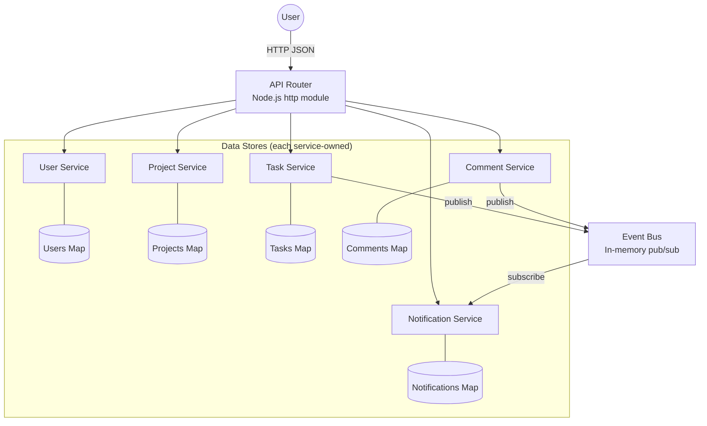

# Task Management API — C4 Model Architecture Specification

## Level 1: System Context

```
workspace {
    model {
        user = person "User" "A person who manages projects, tasks, and collaboration"
        taskMgmt = softwareSystem "Task Management System" "Allows users to manage projects, tasks, comments, and receive notifications" {
            apiRouter = container "API Router" "HTTP entry point, delegates to services" "Node.js http module"
            eventBus = container "Event Bus" "In-memory publish/subscribe message broker" "TypeScript class"
            userService = container "User Service" "Manages user CRUD operations" "TypeScript module" {
                userStore = component "User Store" "In-memory Map<string, User>" "Map"
                userOps = component "User Operations" "create, getById, getAll, update, delete" "TypeScript class"
            }
            projectService = container "Project Service" "Manages projects and membership" "TypeScript module" {
                projectStore = component "Project Store" "In-memory Map<string, Project>" "Map"
                projectOps = component "Project Operations" "CRUD, addMember, removeMember" "TypeScript class"
            }
            taskService = container "Task Service" "Manages tasks with status transitions" "TypeScript module" {
                taskStore = component "Task Store" "In-memory Map<string, Task>" "Map"
                taskOps = component "Task Operations" "CRUD, assign, changeStatus, getByProject" "TypeScript class"
            }
            commentService = container "Comment Service" "Manages comments on tasks" "TypeScript module" {
                commentStore = component "Comment Store" "In-memory Map<string, Comment>" "Map"
                commentOps = component "Comment Operations" "create, getByTask, getById, delete" "TypeScript class"
            }
            notificationService = container "Notification Service" "Creates notifications from events" "TypeScript module" {
                notifStore = component "Notification Store" "In-memory Map<string, Notification>" "Map"
                notifOps = component "Notification Operations" "getByUser, markAsRead" "TypeScript class"
            }
        }

        # Relationships
        user -> apiRouter "Makes HTTP requests to" "JSON/HTTP"
        apiRouter -> userService "Delegates user requests to"
        apiRouter -> projectService "Delegates project requests to"
        apiRouter -> taskService "Delegates task requests to"
        apiRouter -> commentService "Delegates comment requests to"
        apiRouter -> notificationService "Delegates notification requests to"
        taskService -> eventBus "Publishes task.assigned, task.statusChanged"
        commentService -> eventBus "Publishes comment.added"
        eventBus -> notificationService "Delivers events to"
    }
}
```

## Level 2: Container Diagram



## Level 3: Component Detail

### Data Models

**User**
| Field | Type | Description |
|-------|------|-------------|
| id | string | UUID, auto-generated |
| name | string | User's display name |
| email | string | User's email address |

**Project**
| Field | Type | Description |
|-------|------|-------------|
| id | string | UUID, auto-generated |
| name | string | Project name |
| description | string | Project description |
| memberIds | string[] | Array of user IDs |

**Task**
| Field | Type | Description |
|-------|------|-------------|
| id | string | UUID, auto-generated |
| title | string | Task title |
| description | string | Task description |
| status | TaskStatus | `"todo"` | `"in-progress"` | `"done"` |
| assigneeId | string \| null | Assigned user ID |
| projectId | string | Owning project ID |

**Comment**
| Field | Type | Description |
|-------|------|-------------|
| id | string | UUID, auto-generated |
| taskId | string | Parent task ID |
| authorId | string | Author user ID |
| body | string | Comment text |
| createdAt | string | ISO 8601 timestamp |

**Notification**
| Field | Type | Description |
|-------|------|-------------|
| id | string | UUID, auto-generated |
| userId | string | Target user ID |
| message | string | Notification text |
| read | boolean | Read/unread flag |
| createdAt | string | ISO 8601 timestamp |

### Service Operations

**User Service:** create, getById, getAll, update, delete
- Events published: none
- Events subscribed: none

**Project Service:** create, getById, getAll, update, delete, addMember, removeMember
- Events published: none
- Events subscribed: none

**Task Service:** create, getById, getByProject, update, delete, assign, changeStatus
- Status transitions: `todo → in-progress → done` (forward only, enforced)
- Events published:
  - `task.assigned` → `{ taskId, taskTitle, assigneeId }`
  - `task.statusChanged` → `{ taskId, taskTitle, assigneeId, oldStatus, newStatus }`
- Events subscribed: none

**Comment Service:** create, getById, getByTask, delete
- Events published:
  - `comment.added` → `{ commentId, taskId, taskTitle, authorId, authorName }`
- Events subscribed: none

**Notification Service:** getByUser, markAsRead
- Events published: none
- Events subscribed:
  - `task.assigned` → creates notification for assignee
  - `task.statusChanged` → creates notification for assignee
  - `comment.added` → creates notification for task assignee

### Event Bus
- `publish(event: string, payload: any): void`
- `subscribe(event: string, callback: (payload: any) => void): void`

## Level 4: API Routes

| Method | Path | Service | Operation |
|--------|------|---------|-----------|
| GET | /users | UserService | getAll |
| POST | /users | UserService | create |
| GET | /users/:id | UserService | getById |
| PUT | /users/:id | UserService | update |
| DELETE | /users/:id | UserService | delete |
| GET | /projects | ProjectService | getAll |
| POST | /projects | ProjectService | create |
| GET | /projects/:id | ProjectService | getById |
| PUT | /projects/:id | ProjectService | update |
| DELETE | /projects/:id | ProjectService | delete |
| POST | /projects/:id/members | ProjectService | addMember |
| DELETE | /projects/:id/members | ProjectService | removeMember |
| GET | /tasks?projectId=X | TaskService | getByProject |
| POST | /tasks | TaskService | create |
| GET | /tasks/:id | TaskService | getById |
| PUT | /tasks/:id | TaskService | update |
| DELETE | /tasks/:id | TaskService | delete |
| PUT | /tasks/:id/status | TaskService | changeStatus |
| PUT | /tasks/:id/assign | TaskService | assign |
| GET | /comments?taskId=X | CommentService | getByTask |
| POST | /comments | CommentService | create |
| GET | /comments/:id | CommentService | getById |
| DELETE | /comments/:id | CommentService | delete |
| GET | /notifications?userId=X | NotifService | getByUser |
| PUT | /notifications/:id/read | NotifService | markAsRead |

## Architectural Constraints

1. **No direct service-to-service calls.** Services MUST NOT import or call other services directly. All inter-service communication goes through the Event Bus.
2. **Data ownership.** Each service exclusively owns its data store. No service may read or write another service's store.
3. **Single entry point.** All HTTP handling is in the API Router. Services expose plain TypeScript methods, not HTTP endpoints.
4. **Forward-only status transitions.** Task status must follow `todo → in-progress → done`. No backward transitions.
5. **No external dependencies.** Only Node.js built-in modules. No npm packages for the application code (dev tooling like tsx/typescript is fine).
6. **Each service in its own file.** One file per service, one for the event bus, one for the router, one for the main entry point.

## Architectural Decisions

### ADR-001: Event Bus over Direct Calls
- **Decision:** Use in-memory pub/sub for inter-service communication
- **Rationale:** Keeps services decoupled. Adding a new service that reacts to events requires zero changes to existing services.
- **Tradeoff:** Slightly harder to trace execution flow; no compile-time guarantee that event subscribers exist.

### ADR-002: Service-Owned Data Stores
- **Decision:** Each service maintains its own in-memory Map
- **Rationale:** Prevents shared-state bugs. Each service has full control over its data invariants.
- **Tradeoff:** Cross-service queries require coordination through the router, not a single data lookup.

### ADR-003: No External Frameworks
- **Decision:** Use Node.js built-in `http` module only
- **Rationale:** Keeps the system self-contained with zero setup.
- **Tradeoff:** More boilerplate for request parsing and routing.

## File Structure

```
src/
├── event-bus.ts
├── services/
│   ├── user-service.ts
│   ├── project-service.ts
│   ├── task-service.ts
│   ├── comment-service.ts
│   └── notification-service.ts
├── router.ts
├── main.ts
└── demo.ts
```

## Demo Script

Include a demo script that starts the server and runs through: create users → create project → add members → create tasks → assign tasks → change status → add comments → check notifications. Validates the end-to-end flow.
