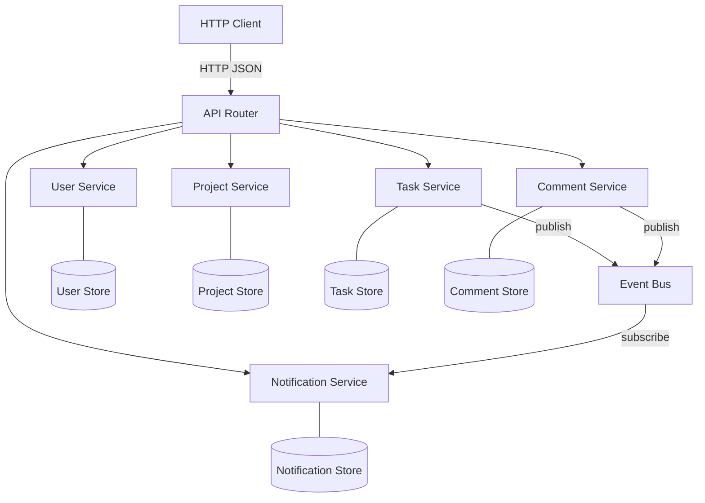

# Task Management API — OpenAPI + Architecture Specification

## System Architecture



## Constraints

1. **No direct service-to-service calls.** Services MUST NOT import or call other services directly. All inter-service communication goes through the Event Bus.
2. **Data ownership.** Each service exclusively owns its data store. No service may read or write another service's store.
3. **Single entry point.** All HTTP handling is in the API Router. Services expose plain TypeScript methods, not HTTP endpoints.
4. **Forward-only status transitions.** Task status must follow `todo → in-progress → done`. No backward transitions.
5. **No external dependencies.** Only Node.js built-in modules. No npm packages for the application code (dev tooling like tsx/typescript is fine).
6. **Each service in its own file.** One file per service, one for the event bus, one for the router, one for the main entry point.

## OpenAPI 3.0 Specification

```yaml
openapi: 3.0.3
info:
  title: Task Management API
  version: 1.0.0
  description: Multi-service task management system with event-driven architecture

paths:
  /users:
    get:
      summary: List all users
      responses:
        '200':
          description: Array of users
          content:
            application/json:
              schema:
                type: array
                items:
                  $ref: '#/components/schemas/User'
    post:
      summary: Create a user
      requestBody:
        required: true
        content:
          application/json:
            schema:
              $ref: '#/components/schemas/CreateUserInput'
      responses:
        '201':
          description: Created user
          content:
            application/json:
              schema:
                $ref: '#/components/schemas/User'

  /users/{id}:
    parameters:
      - name: id
        in: path
        required: true
        schema:
          type: string
    get:
      summary: Get user by ID
      responses:
        '200':
          description: User found
          content:
            application/json:
              schema:
                $ref: '#/components/schemas/User'
        '404':
          description: User not found
    put:
      summary: Update user
      requestBody:
        required: true
        content:
          application/json:
            schema:
              $ref: '#/components/schemas/UpdateUserInput'
      responses:
        '200':
          description: Updated user
          content:
            application/json:
              schema:
                $ref: '#/components/schemas/User'
        '404':
          description: User not found
    delete:
      summary: Delete user
      responses:
        '204':
          description: User deleted
        '404':
          description: User not found

  /projects:
    get:
      summary: List all projects
      responses:
        '200':
          description: Array of projects
          content:
            application/json:
              schema:
                type: array
                items:
                  $ref: '#/components/schemas/Project'
    post:
      summary: Create a project
      requestBody:
        required: true
        content:
          application/json:
            schema:
              $ref: '#/components/schemas/CreateProjectInput'
      responses:
        '201':
          description: Created project
          content:
            application/json:
              schema:
                $ref: '#/components/schemas/Project'

  /projects/{id}:
    parameters:
      - name: id
        in: path
        required: true
        schema:
          type: string
    get:
      summary: Get project by ID
      responses:
        '200':
          description: Project found
          content:
            application/json:
              schema:
                $ref: '#/components/schemas/Project'
        '404':
          description: Project not found
    put:
      summary: Update project
      requestBody:
        required: true
        content:
          application/json:
            schema:
              $ref: '#/components/schemas/UpdateProjectInput'
      responses:
        '200':
          description: Updated project
          content:
            application/json:
              schema:
                $ref: '#/components/schemas/Project'
        '404':
          description: Project not found
    delete:
      summary: Delete project
      responses:
        '204':
          description: Project deleted
        '404':
          description: Project not found

  /projects/{id}/members:
    parameters:
      - name: id
        in: path
        required: true
        schema:
          type: string
    post:
      summary: Add member to project
      requestBody:
        required: true
        content:
          application/json:
            schema:
              type: object
              properties:
                userId:
                  type: string
              required: [userId]
      responses:
        '200':
          description: Updated project
          content:
            application/json:
              schema:
                $ref: '#/components/schemas/Project'
        '404':
          description: Project not found
    delete:
      summary: Remove member from project
      requestBody:
        required: true
        content:
          application/json:
            schema:
              type: object
              properties:
                userId:
                  type: string
              required: [userId]
      responses:
        '200':
          description: Updated project
          content:
            application/json:
              schema:
                $ref: '#/components/schemas/Project'
        '404':
          description: Project not found

  /tasks:
    get:
      summary: List tasks by project
      parameters:
        - name: projectId
          in: query
          required: true
          schema:
            type: string
      responses:
        '200':
          description: Array of tasks
          content:
            application/json:
              schema:
                type: array
                items:
                  $ref: '#/components/schemas/Task'
    post:
      summary: Create a task
      requestBody:
        required: true
        content:
          application/json:
            schema:
              $ref: '#/components/schemas/CreateTaskInput'
      responses:
        '201':
          description: Created task
          content:
            application/json:
              schema:
                $ref: '#/components/schemas/Task'

  /tasks/{id}:
    parameters:
      - name: id
        in: path
        required: true
        schema:
          type: string
    get:
      summary: Get task by ID
      responses:
        '200':
          description: Task found
          content:
            application/json:
              schema:
                $ref: '#/components/schemas/Task'
        '404':
          description: Task not found
    put:
      summary: Update task
      requestBody:
        required: true
        content:
          application/json:
            schema:
              $ref: '#/components/schemas/UpdateTaskInput'
      responses:
        '200':
          description: Updated task
          content:
            application/json:
              schema:
                $ref: '#/components/schemas/Task'
        '404':
          description: Task not found
    delete:
      summary: Delete task
      responses:
        '204':
          description: Task deleted
        '404':
          description: Task not found

  /tasks/{id}/status:
    parameters:
      - name: id
        in: path
        required: true
        schema:
          type: string
    put:
      summary: Change task status (forward-only transitions)
      requestBody:
        required: true
        content:
          application/json:
            schema:
              type: object
              properties:
                status:
                  $ref: '#/components/schemas/TaskStatus'
              required: [status]
      responses:
        '200':
          description: Updated task
          content:
            application/json:
              schema:
                $ref: '#/components/schemas/Task'
        '400':
          description: Invalid status transition
        '404':
          description: Task not found

  /tasks/{id}/assign:
    parameters:
      - name: id
        in: path
        required: true
        schema:
          type: string
    put:
      summary: Assign task to user
      requestBody:
        required: true
        content:
          application/json:
            schema:
              type: object
              properties:
                assigneeId:
                  type: string
              required: [assigneeId]
      responses:
        '200':
          description: Updated task
          content:
            application/json:
              schema:
                $ref: '#/components/schemas/Task'
        '404':
          description: Task not found

  /comments:
    get:
      summary: List comments by task
      parameters:
        - name: taskId
          in: query
          required: true
          schema:
            type: string
      responses:
        '200':
          description: Array of comments
          content:
            application/json:
              schema:
                type: array
                items:
                  $ref: '#/components/schemas/Comment'
    post:
      summary: Create a comment
      requestBody:
        required: true
        content:
          application/json:
            schema:
              $ref: '#/components/schemas/CreateCommentInput'
      responses:
        '201':
          description: Created comment
          content:
            application/json:
              schema:
                $ref: '#/components/schemas/Comment'

  /comments/{id}:
    parameters:
      - name: id
        in: path
        required: true
        schema:
          type: string
    get:
      summary: Get comment by ID
      responses:
        '200':
          description: Comment found
          content:
            application/json:
              schema:
                $ref: '#/components/schemas/Comment'
        '404':
          description: Comment not found
    delete:
      summary: Delete comment
      responses:
        '204':
          description: Comment deleted
        '404':
          description: Comment not found

  /notifications:
    get:
      summary: List notifications for user
      parameters:
        - name: userId
          in: query
          required: true
          schema:
            type: string
      responses:
        '200':
          description: Array of notifications
          content:
            application/json:
              schema:
                type: array
                items:
                  $ref: '#/components/schemas/Notification'

  /notifications/{id}/read:
    parameters:
      - name: id
        in: path
        required: true
        schema:
          type: string
    put:
      summary: Mark notification as read
      responses:
        '200':
          description: Updated notification
          content:
            application/json:
              schema:
                $ref: '#/components/schemas/Notification'
        '404':
          description: Notification not found

components:
  schemas:
    User:
      type: object
      properties:
        id:
          type: string
        name:
          type: string
        email:
          type: string
      required: [id, name, email]

    CreateUserInput:
      type: object
      properties:
        name:
          type: string
        email:
          type: string
      required: [name, email]

    UpdateUserInput:
      type: object
      properties:
        name:
          type: string
        email:
          type: string

    Project:
      type: object
      properties:
        id:
          type: string
        name:
          type: string
        description:
          type: string
        memberIds:
          type: array
          items:
            type: string
      required: [id, name, description, memberIds]

    CreateProjectInput:
      type: object
      properties:
        name:
          type: string
        description:
          type: string
      required: [name, description]

    UpdateProjectInput:
      type: object
      properties:
        name:
          type: string
        description:
          type: string

    TaskStatus:
      type: string
      enum: [todo, in-progress, done]

    Task:
      type: object
      properties:
        id:
          type: string
        title:
          type: string
        description:
          type: string
        status:
          $ref: '#/components/schemas/TaskStatus'
        assigneeId:
          type: string
          nullable: true
        projectId:
          type: string
      required: [id, title, description, status, projectId]

    CreateTaskInput:
      type: object
      properties:
        title:
          type: string
        description:
          type: string
        projectId:
          type: string
      required: [title, description, projectId]

    UpdateTaskInput:
      type: object
      properties:
        title:
          type: string
        description:
          type: string

    Comment:
      type: object
      properties:
        id:
          type: string
        taskId:
          type: string
        authorId:
          type: string
        body:
          type: string
        createdAt:
          type: string
          format: date-time
      required: [id, taskId, authorId, body, createdAt]

    CreateCommentInput:
      type: object
      properties:
        taskId:
          type: string
        authorId:
          type: string
        body:
          type: string
      required: [taskId, authorId, body]

    Notification:
      type: object
      properties:
        id:
          type: string
        userId:
          type: string
        message:
          type: string
        read:
          type: boolean
        createdAt:
          type: string
          format: date-time
      required: [id, userId, message, read, createdAt]
```

## Event Bus

In-memory publish/subscribe for inter-service communication.

**Interface:**
- `publish(event: string, payload: any): void`
- `subscribe(event: string, callback: (payload: any) => void): void`

**Events:**

| Event | Publisher | Payload | Subscriber |
|-------|----------|---------|------------|
| `task.assigned` | TaskService | `{ taskId, taskTitle, assigneeId }` | NotificationService |
| `task.statusChanged` | TaskService | `{ taskId, taskTitle, assigneeId, oldStatus, newStatus }` | NotificationService |
| `comment.added` | CommentService | `{ commentId, taskId, taskTitle, authorId, authorName }` | NotificationService |

## Architectural Decisions

### ADR-001: Event Bus over Direct Calls
- **Decision:** Use in-memory pub/sub for inter-service communication
- **Rationale:** Keeps services decoupled. Adding a new service that reacts to events requires zero changes to existing services.
- **Tradeoff:** Slightly harder to trace execution flow; no compile-time guarantee that event subscribers exist.

### ADR-002: Service-Owned Data Stores
- **Decision:** Each service maintains its own in-memory Map
- **Rationale:** Prevents shared-state bugs. Each service has full control over its data invariants.
- **Tradeoff:** Cross-service queries require coordination through the router, not a single data lookup.

### ADR-003: No External Frameworks
- **Decision:** Use Node.js built-in `http` module only
- **Rationale:** Keeps the system self-contained with zero setup.
- **Tradeoff:** More boilerplate for request parsing and routing.

## File Structure

```
src/
├── event-bus.ts
├── services/
│   ├── user-service.ts
│   ├── project-service.ts
│   ├── task-service.ts
│   ├── comment-service.ts
│   └── notification-service.ts
├── router.ts
├── main.ts
└── demo.ts
```

## Demo Script

Include a demo script that starts the server and runs through: create users → create project → add members → create tasks → assign tasks → change status → add comments → check notifications. Validates the end-to-end flow.
