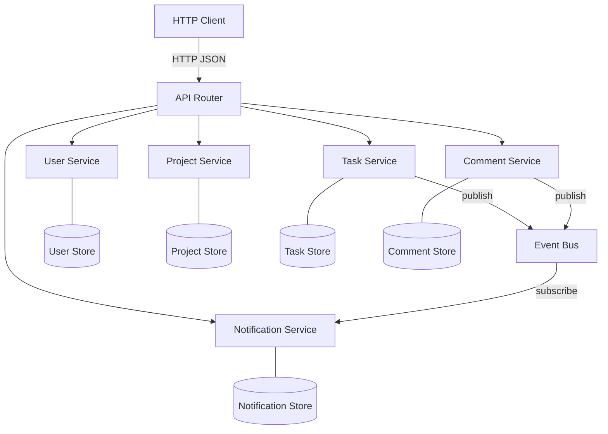
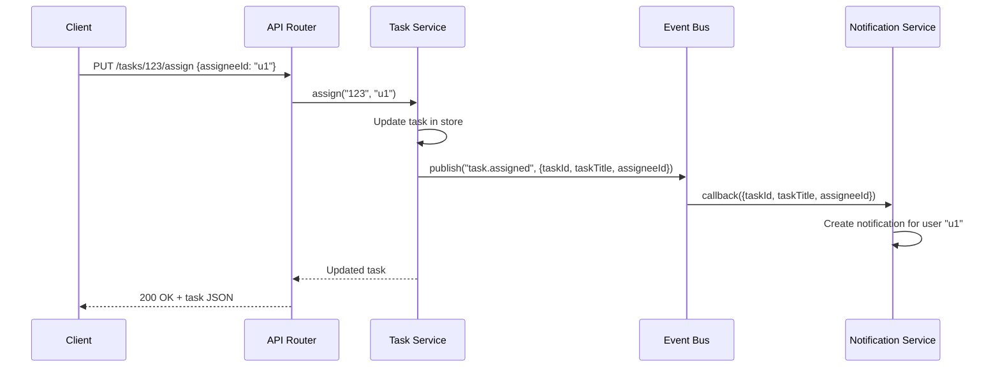

# Task Management API — Architecture Specification

## System Architecture



## Component Specifications

### Event Bus
- **Type:** In-memory publish/subscribe
- **Interface:**
  - `publish(event: string, payload: any): void`
  - `subscribe(event: string, callback: (payload: any) => void): void`

### User Service
- **Data:** `{ id, name, email }`
- **Storage:** In-memory Map
- **Operations:** CRUD (create, getById, getAll, update, delete)
- **Events published:** None
- **Events subscribed:** None

### Project Service
- **Data:** `{ id, name, description, memberIds[] }`
- **Storage:** In-memory Map
- **Operations:** CRUD, addMember, removeMember
- **Events published:** None
- **Events subscribed:** None

### Task Service
- **Data:** `{ id, title, description, status, assigneeId, projectId }`
- **Storage:** In-memory Map
- **Operations:** CRUD, assign, changeStatus, getByProject
- **Status transitions:** `todo → in-progress → done` (forward only)
- **Events published:**
  - `task.assigned` → `{ taskId, taskTitle, assigneeId }`
  - `task.statusChanged` → `{ taskId, taskTitle, assigneeId, oldStatus, newStatus }`
- **Events subscribed:** None

### Comment Service
- **Data:** `{ id, taskId, authorId, body, createdAt }`
- **Storage:** In-memory Map
- **Operations:** create, getByTask, getById, delete
- **Events published:**
  - `comment.added` → `{ commentId, taskId, taskTitle, authorId, authorName }`
- **Events subscribed:** None

### Notification Service
- **Data:** `{ id, userId, message, read, createdAt }`
- **Storage:** In-memory Map
- **Operations:** getByUser, markAsRead
- **Events subscribed:**
  - `task.assigned` → creates notification for assignee
  - `task.statusChanged` → creates notification for assignee
  - `comment.added` → creates notification for task assignee

### API Router
- **Role:** HTTP entry point, delegates to services
- **Technology:** Node.js built-in `http` module (no frameworks)
- **Format:** JSON request/response bodies

#### Route Table

| Method | Path | Service | Operation |
|--------|------|---------|-----------|
| GET | /users | UserService | getAll |
| POST | /users | UserService | create |
| GET | /users/:id | UserService | getById |
| PUT | /users/:id | UserService | update |
| DELETE | /users/:id | UserService | delete |
| GET | /projects | ProjectService | getAll |
| POST | /projects | ProjectService | create |
| GET | /projects/:id | ProjectService | getById |
| PUT | /projects/:id | ProjectService | update |
| DELETE | /projects/:id | ProjectService | delete |
| POST | /projects/:id/members | ProjectService | addMember |
| DELETE | /projects/:id/members | ProjectService | removeMember |
| GET | /tasks?projectId=X | TaskService | getByProject |
| POST | /tasks | TaskService | create |
| GET | /tasks/:id | TaskService | getById |
| PUT | /tasks/:id | TaskService | update |
| DELETE | /tasks/:id | TaskService | delete |
| PUT | /tasks/:id/status | TaskService | changeStatus |
| PUT | /tasks/:id/assign | TaskService | assign |
| GET | /comments?taskId=X | CommentService | getByTask |
| POST | /comments | CommentService | create |
| GET | /comments/:id | CommentService | getById |
| DELETE | /comments/:id | CommentService | delete |
| GET | /notifications?userId=X | NotifService | getByUser |
| PUT | /notifications/:id/read | NotifService | markAsRead |

## Data Flow: Task Assignment



## Constraints

1. **No direct service-to-service calls.** Services MUST NOT import or call other services directly. All inter-service communication goes through the Event Bus.
2. **Data ownership.** Each service exclusively owns its data store. No service may read or write another service's store.
3. **Single entry point.** All HTTP handling is in the API Router. Services expose plain TypeScript methods, not HTTP endpoints.
4. **Forward-only status transitions.** Task status must follow `todo → in-progress → done`. No backward transitions.
5. **No external dependencies.** Only Node.js built-in modules. No npm packages for the application code (dev tooling like tsx/typescript is fine).
6. **Each service in its own file.** One file per service, one for the event bus, one for the router, one for the main entry point.

## Architectural Decisions

### ADR-001: Event Bus over Direct Calls
- **Decision:** Use in-memory pub/sub for inter-service communication
- **Rationale:** Keeps services decoupled. Adding a new service that reacts to events requires zero changes to existing services.
- **Tradeoff:** Slightly harder to trace execution flow; no compile-time guarantee that event subscribers exist.

### ADR-002: Service-Owned Data Stores
- **Decision:** Each service maintains its own in-memory Map
- **Rationale:** Prevents shared-state bugs. Each service has full control over its data invariants.
- **Tradeoff:** Cross-service queries (e.g., "get task with assignee name") require coordination through the router, not a single data lookup.

### ADR-003: No External Frameworks
- **Decision:** Use Node.js built-in `http` module only
- **Rationale:** Keeps the system self-contained with zero setup. The experiment focuses on architectural patterns, not framework usage.
- **Tradeoff:** More boilerplate for request parsing and routing.

## File Structure

```
src/
├── event-bus.ts          # Event Bus implementation
├── services/
│   ├── user-service.ts
│   ├── project-service.ts
│   ├── task-service.ts
│   ├── comment-service.ts
│   └── notification-service.ts
├── router.ts             # API Router
├── main.ts               # Entry point: wiring + server start
└── demo.ts               # Demo script exercising all features
```

## Demo Script

Include a demo script that starts the server and runs through: create users → create project → add members → create tasks → assign tasks → change status → add comments → check notifications. Validates the end-to-end flow.
